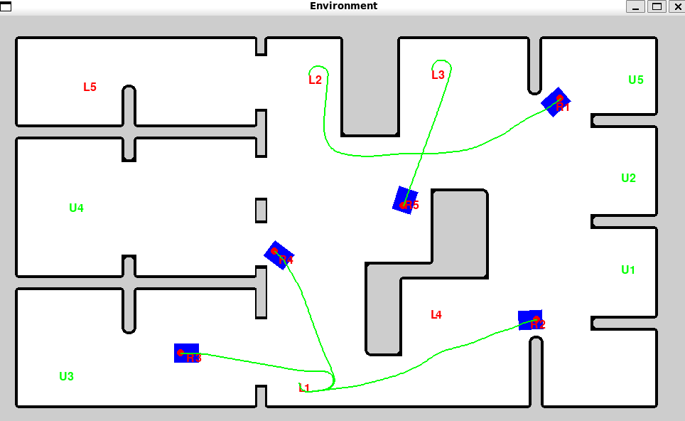

# Reinforcment Learning environment for Master's thesis

This program uses Ray RLib to do reinforcement learning (PPO) to teach courier agents to control robots.

## Program description
**There are 3 types of agents:**
- Loaders
- Unloaders
- Couriers

Loaders spawn tasks and assign them to couriers. Couriers are responsible for delivering packages to unloader.

Courier agents must learn to either FOLLOW_PATH or WAIT.

### Observations


**Each COURIER agent has the following observation space:**
- ```dx_to_goal [-1; 1]```
- ```dy_to_goal [-1; 1]```
- ```heading_sin [-1; 1]```
- ```heading_cos [-1; 1]```
- ```remaining_path_len [0; 1]```
- ```idle_timer [0; 1]```
- ```front_busy {0, 1}```
- ```no_blocked_agents {0, 1}```
- ```min_front_dist [0; 1]```
- For 2 closest agents (if not enough agents, pad with 0):
    - ```dx_rel [-1; 1]```
    - ```dy_rel [-1; 1]```
    - ```heading_sin [-1; 1]```
    - ```heading_cos [-1; 1]```
    - ```is_waiting {0, 1}```

### Actions

**Each courier can perform these actions:**
- ```0```: Stay idle
- ```1```: Follow path

### Reward function

**Reward function relies on observation. Reward weights:**  
- Reward progress towards goal:  
$W_{progress} = +10.0$  
- One time reward for reaching goal  
$W_{goal\_arrival} = +200.0$
- Penalize collisions  
$W_{collision} = -500.0$
- Penalize staying idle for no good reason  
$W_{idle\_penalty} = -1.0$  
- Penalize waiting while nothing blocks front  
  $W_{front\_busy\_penalty} = -5.0$  
- Penalize blocking somebody else  
  $W_{blocking\_penalty} = -8.0$  
- Penalize tail-gating (dist < safe)  
  $W_{follow\_dist\_penalty} = -3.0$  
- Penalize path failure (FOLLOW_PATH but path length == 0)  
  $W_{plan\_fail\_penalty} = -3.0$   

$$
R = \Sigma W = W_{progress} + W_{goal\_arrival} + W_{collision} + W_{idle\_penalty} + W_{front\_busy\_penalty} + W_{blocking\_penalty} + W_{follow\_dist\_penalty} + W_{plan\_fail\_penalty} + W_{reverse\_penalty} + W_{path\_deviation\_penalty} + W_{speed\_fluctuation\_penalty} + W_{safe\_distance} + W_{sharp\_turn\_penalty} + W_{optimal\_velocity}
$$


## Setup

### Setup virtual environment (recommended)
```
python3 -m venv learn_env
. learn_env/bin/activate
```
### Install requirements
```
pip install -r requirements.txt
```

## Run training or test environment
```
python3 test/train_test.py
```
```
python3 test/enviornment_test.py
```
